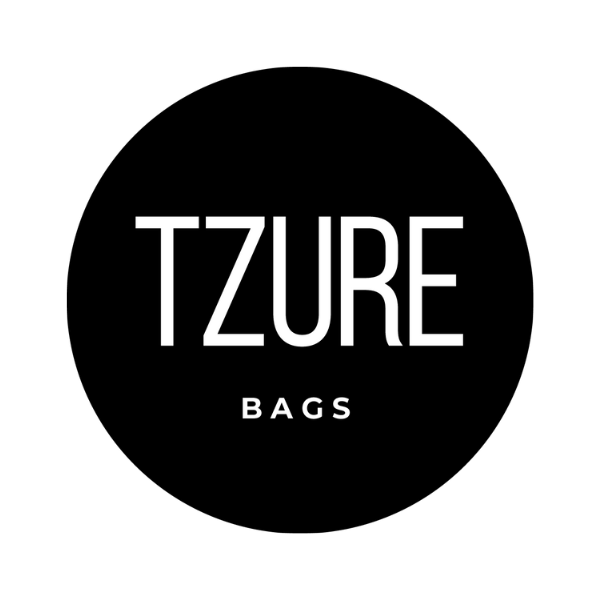

# E-Commerce TZURE BAGS

Es un E-commerce desarrolado para la marca Tzure Bags, como proyecto final para el curso de React.Js de Coder House- Comisión: #34680 Julio- Septiembre 2022
<[https://calculadora-react-puce.vercel.app/]/>

## Las tecnologías utilizadas en el desarrollo del proyecto son:
* HTML5
* CSS3
* JavaScript 
* React.js
* Bootstrap 
* Reactstrap
* Node.js
* Vercel

## Sobre la marca
 

Es un microemprendimiento de elaboración personalizada de riñoneras hechas a mano, cruelty free, creadas con material sustentable y amigable con el medio ambiente. 

## Contacto:
* Creador: Génesis Pérez.
* Mail: genesisbetaly@gmail.com
* Celular: 1122523162

